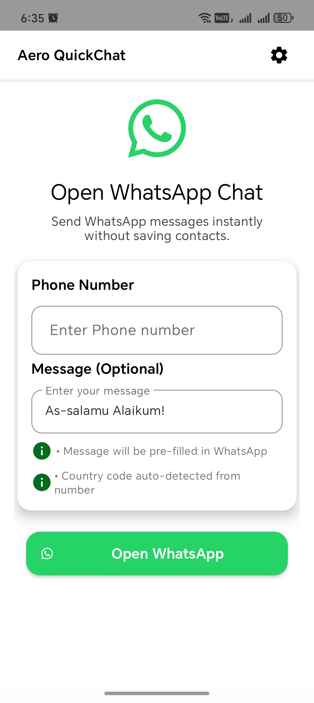
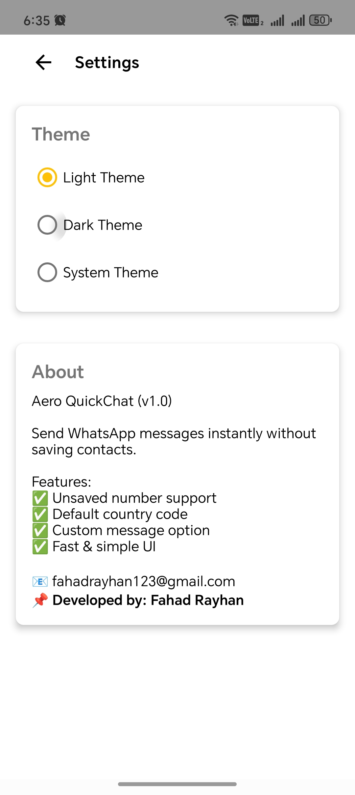

# AeroQuickChat

A modern Android application for quick WhatsApp messaging with an enhanced UI/UX design and Material Design components.

## Features

- **Quick WhatsApp Integration**: Send messages directly to WhatsApp contacts without saving phone numbers.
- **Modern Material Design**: Clean, intuitive interface following Material Design 3 guidelines with an updated color palette.
- **Automatic Country Detection**: Smart country code detection from phone number input with Bangladesh (+880) as the default.
- **Enhanced Typography**: Improved text hierarchy with system fonts for better readability.
- **Smart Error Notifications**: Non-intrusive toast-style notifications with visual input field error styling.
- **Premium WhatsApp Logo**: High-quality vector logo with gradient styling and modern design.
- **Settings Management**: Customizable app settings and preferences with a modern card-based design.
- **Responsive Design**: Optimized for various screen sizes and orientations.
- **Material Components**: Updated UI components with proper theming and consistent styling.
- **Dynamic Theme Support**: Full dark/light mode support with Material Design 3 color schemes.
- **Auto-dismiss Notifications**: Smart error handling with automatic dismissal and real-time input validation.

## Screenshots




## Installation

### Prerequisites

- Android Studio Arctic Fox or later
- Android SDK API level 24 or higher
- Kotlin 1.9+
- Gradle 8.0+

### Setup

1. Open the project in Android Studio.
2. Sync the project with Gradle files.
3. Build and run the application.

## Usage

1. **Enter Phone Number**: Input the recipient's phone number with the country code (the app automatically detects the country from the number prefix).
2. **Smart Formatting**: Phone numbers are automatically formatted based on the detected country code.
3. **Compose Message**: Type your message in the text field.
4. **Send via WhatsApp**: Tap the "Open WhatsApp" button to launch WhatsApp with your message.

## Technical Details

### Architecture

- **Language**: Kotlin
- **UI Framework**: Android Views with View Binding
- **Design System**: Material Design 3
- **Minimum SDK**: API 24 (Android 7.0)
- **Target SDK**: API 34 (Android 14)

### Key Components

- `MainActivity.kt`: Main application interface with phone number input and WhatsApp integration.
- `SettingsActivity.kt`: Settings and preferences management with a modern card-based layout.
- `ErrorHandler.kt`: Centralized error handling with toast-style notifications.
- `toast_error.xml`: Modern error notification layout with Material Design cards.
- `themes.xml`: Material Design 3 theming with a custom color palette and typography.
- `colors.xml`: Modern color scheme with primary, secondary, and accent colors.

### Dependencies

- Material Design Components
- AndroidX Libraries
- ViewBinding

## Project Structure

```
app/
├── src/main/
│   ├── java/com/example/aeroquickchat/
│   │   ├── MainActivity.kt
│   │   ├── SettingsActivity.kt
│   │   └── ErrorHandler.kt
│   ├── res/
│   │   ├── layout/
│   │   ├── values/
│   │   ├── drawable/
│   │   └── mipmap/
│   └── AndroidManifest.xml
└── build.gradle.kts
```

## Contributing

Contributions are welcome! Please follow these steps:
1. Fork the repository.
2. Create a feature branch (`git checkout -b feature/amazing-feature`).
3. Commit your changes (`git commit -m 'Add some amazing feature'`).
4. Push to the branch (`git push origin feature/amazing-feature`).
5. Open a Pull Request.

## Recent Updates

- ✅ **README Update**: Analyzed the project and updated the README for accuracy by Gemini.
- ✅ **Dynamic Theme Support**: Complete dark/light mode implementation with Material Design 3 colors.
- ✅ **Automatic Country Detection**: Smart country code detection replacing manual dropdown selection.
- ✅ **Toast-Style Notifications**: Replaced full-page error dialogs with elegant top notifications.
- ✅ **Enhanced WhatsApp Logo**: Premium vector logo with gradient styling and 48dp size.
- ✅ **Auto-dismiss Errors**: Smart notification system with 5-second auto-dismiss for non-critical errors.
- ✅ **Improved Phone Formatting**: Country-specific phone number validation and formatting with auto-detection.
- ✅ **Material Design 3 Colors**: Complete color scheme overhaul for both light and dark themes.
- ✅ **Error Input Styling**: Phone number input field turns red with visual feedback on validation errors.
- ✅ **Dark Mode Text Fix**: Proper text color adaptation for the about page in dark mode.

## License

This project is licensed under the MIT License.

## Acknowledgments

- The Material Design team for their design guidelines.
- The Android development community.
- WhatsApp for providing URL scheme integration.

---

**Made with ❤️ for seamless WhatsApp communication**
